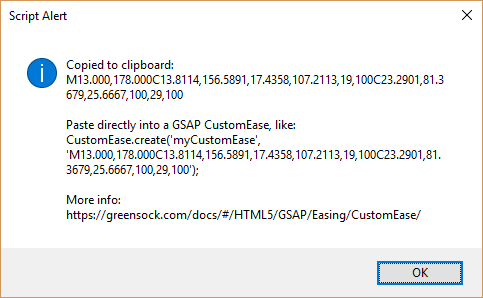

# ae-ease-to-gsap-customease 
Converts the keyframes of the selected property in After Effects to a set of SVG path commands that can be used directly in GreenSock's CustomEase plugin. Works on Windows and MacOS.

> **BETA NOTICE:** This script is currently in an early beta. It may not work with all layers and properties.
Most of these limitations will be fairly straightforward to overcome, but we wanted to get this script out in public ASASP.

## Motivation
Ever wished you could take your ease curve from the graph editor in After Effects and somehow use it directly
in your [GSAP](https://greensock.com/gsap) animation? Now you can.

## Installation
1. [Click here](https://github.com/SupportClass/ae-ease-to-gsap-customease/raw/master/ae-ease-to-gsap-customease.jsx)
to download `ae-ease-to-gsap-customease.jsx`, and save it to a place where you can find it again easily.

## Usage
1. Open your After Effects project.
2. Select the layer whose ease curve you wish to export.
3. Select the property (such as Scale, Opacity, etc) whose ease curve you wish to export.
4. Go to "File > Scripts > Run Script File..."
5. Browser to where you downloaded `ae-ease-to-gsap-customease.jsx` and select it, then click "Open".
6. If the script ran successfully, you will see an alert like this:

	
7. You can now paste the contents of your clipboard directly into a [GSAP CustomEase](https://greensock.com/docs/#/HTML5/GSAP/Easing/CustomEase/).

To preview your ease, you can paste it into GreenSock's "[Ease Visualizer](https://greensock.com/docs/#/HTML5/GSAP/Easing/CustomEase/)" tool.

## Thanks
In writing this script, I studied code from
- [@turbodrive](https://github.com/turbodrive) ([Source](https://gist.github.com/turbodrive/a0913ac83e3d5d5f5b15))
- [@juancabrera](https://github.com/juancabrera) ([Source](https://gist.github.com/juancabrera/026fb883cb2bae93bd21))
- [@bodymovin](https://github.com/bodymovin) ([Source](https://github.com/bodymovin/bodymovin))

I also received guidance from [@zlovatt](https://github.com/zlovatt), who made time to answer my beginner questions.

## License
[MIT](LICENSE)
